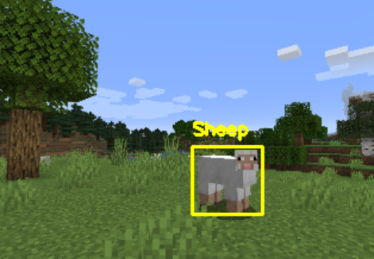

# Object Detection in Minecraft using YoloV3

## Objective

Recognizing sheeps in Minecraft in a live gameplay using OpenCV and YoloV3 with a custom detection model.

## How to use

Start the yolo.py script while running Minecraft (v. 1.16.2 or change it in the script) in windowed mode and walk up to a sheep mob. The script will show you a yellow bounding box and the label "Sheep" if it is detected correctly together with a confidence score in percent. 
